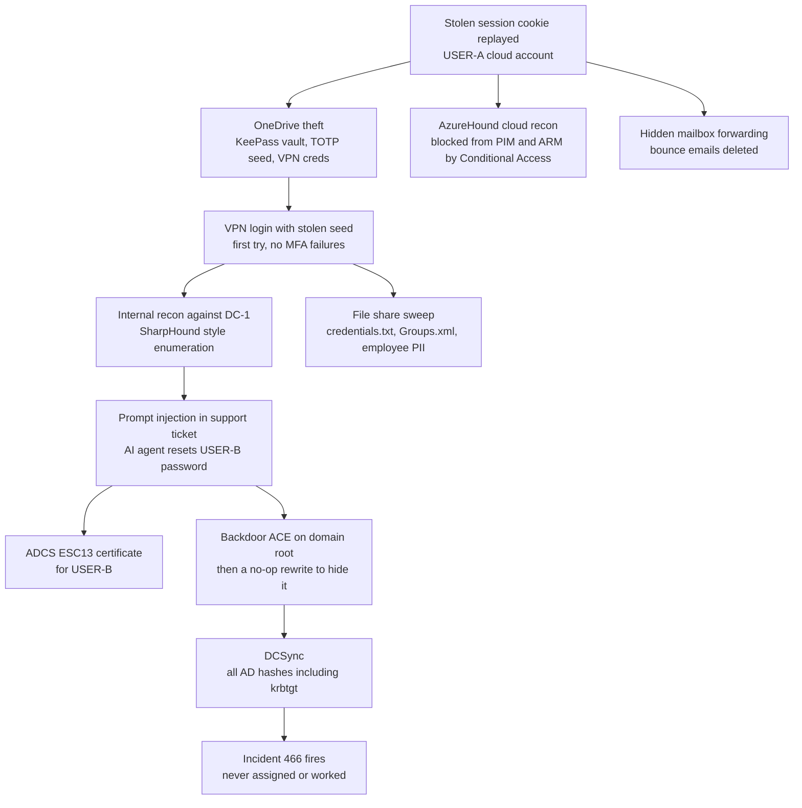

# Operation Helpline: Investigation Report

**An AI helpdesk agent was tricked into resetting a password, and it led to full domain compromise.**

Investigation of a hybrid cloud and on-prem intrusion at a fictional company, Greenfield Logistics, carried out in a simulated environment on the Log(N) Pacific threat hunting platform using Microsoft Sentinel and KQL.

📄 [Read the full investigation report (PDF)](Operation_Helpline_Investigation_Report_REDACTED-3.pdf)

---

## TL;DR

* An attacker replayed a **stolen session cookie** to get into a user's cloud account. No password was guessed or phished.
* From OneDrive they took a **KeePass vault holding the user's MFA (TOTP) seed** plus a VPN credential file, then used both to log into the corporate VPN on the first try.
* They hid fake authorisation text inside a genuine support ticket, and the **AI helpdesk agent reset a second user's password** to a value the attacker chose.
* With that account they abused a misconfigured **ADCS certificate template (ESC13)**, added a **backdoor ACE to the domain root**, and ran **DCSync** to pull every password hash in AD, including **krbtgt**.
* They then stole credential files and a file containing **SSNs and dates of birth for 5 employees**, which made this a reportable data breach.
* Detection worked: the DCSync activity was correctly alerted and correlated into an incident. **Nobody worked it.** The incident sat unassigned with no owner.
* The real root cause, the AI agent's manipulated tool call, had **zero detection coverage** in either workspace.

---

## Attack chain

---

## Key findings

| # | Finding | Why it matters |
|---|---|---|
| F1 | Initial access by session cookie replay | A password reset alone would not have stopped it |
| F4 | Mail forwarding set on the mailbox object, not an inbox rule | A normal inbox rule hunt comes back clean |
| F6 | VPN login passed MFA first try with no failures | Points to a stolen TOTP seed, not a relayed code |
| F8 | AI agent's "authorisation gate" just pattern matched a reference string | **Root cause** of the whole on-prem compromise |
| F10 | Malicious ACE written, then rewritten with identical bytes after DCSync | Fools any audit that only checks the latest write |
| F11 | 39 replication requests in 5 seconds, no process activity on the DC | Classic DCSync over DRSUAPI, krbtgt compromised |
| F13 | Correct incident created, status stayed New with no owner | A response failure, not a detection failure |
| F14 | No rule watches AI agent tool call logs | The best evidence in the case was invisible to the SOC |

The report also includes **negative findings** (what I looked for and ruled out) and a confidence level for every finding.

---

## MITRE ATT&CK mapping

| Tactic | Technique | ID |
|---|---|---|
| Initial Access | Steal Web Session Cookie | T1539 |
| Credential Access | Password Managers (KeePass) | T1555.005 |
| Discovery | Cloud Infrastructure Discovery (AzureHound) | T1580 |
| Persistence | Additional Email Delegate Permissions (forwarding) | T1098.002 |
| Defense Evasion | Indicator Removal | T1070 |
| Lateral Movement | External Remote Services (VPN) | T1133 |
| Discovery | Network Service Discovery | T1046 |
| Discovery | Domain Account / Trust Discovery | T1087.002 / T1482 |
| Privilege Escalation | AI agent manipulation (closest match: Trusted Relationship) | T1199 |
| Credential Access | Group Policy Preferences (cpassword) | T1552.006 |
| Credential Access | Credentials In Files | T1552.001 |
| Privilege Escalation | Steal or Forge Authentication Certificates (ESC13) | T1649 |
| Persistence | Domain Policy Modification / Account Manipulation | T1484 / T1098 |
| Credential Access | DCSync | T1003.006 |
| Collection | Data from Network Shared Drive | T1039 |

---

## Top recommendations

1. **Verify before the agent acts.** AI agent tool calls that do sensitive things must check a real approval system, not free text in a ticket.
2. **Auto assign high severity incidents** the moment they are created so nothing sits unworked.
3. **Correlate AI agent logs with identity events**, joining `LLMAgentLogs_CL` to SecurityEvent 4724 on the same account in a tight time window.
4. **Move MFA from TOTP to FIDO2/WebAuthn**, and never store MFA seeds alongside passwords.
5. **Rotate credentials in dependency order**: sessions, remove the ACE, krbtgt twice (with replication time between), DSRM, then downstream accounts and vaults.
6. **Fix the ADCS template and remove GPP cpassword files** instead of just revoking or rotating.

---

## Tools and data sources

**Microsoft Sentinel · KQL · Microsoft Defender for Endpoint · Entra ID · Defender for Identity · Exchange Online audit logs · AD SecurityEvent logs · ADCS logs · AI agent logs (LLMAgentLogs_CL, MCPToolCalls_CL)**

---

## Note on redaction

This is a simulated environment. Usernames, IPs, email addresses and credentials in the report are replaced with placeholders such as `USER-A` and `[REDACTED-IP-EXTERNAL]`.

*Author: David Koschmann ([@PixelCode](https://hunt.lognpacific.com) on the Log(N) Pacific hunt platform)*
